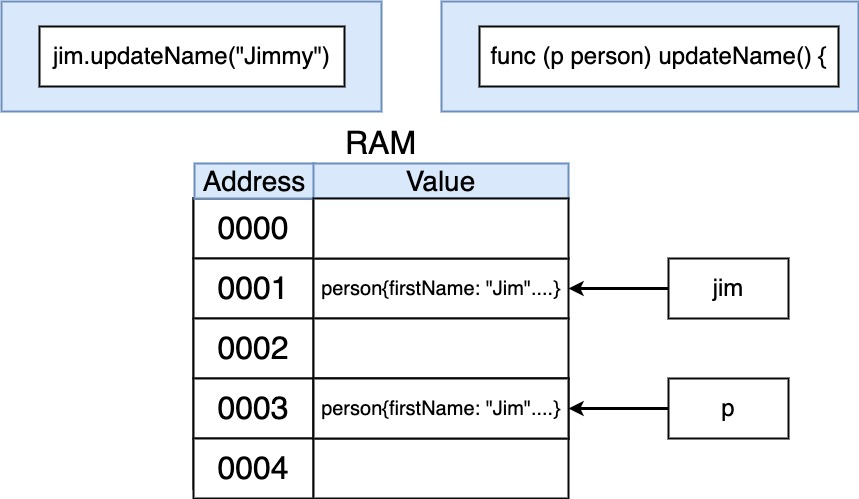

Go is a pass by value language. So any time we pass a value to a func, either as a receiver or as an argument, that data is copied in memory.

# Dev

    $ nodemon --exec go run server.go --signal SIGTERM

- [gqlgen](https://gqlgen.com/getting-started/)

# Commands

```
    $ go test               // runs all the test that under *_test.go
    $ golangci-lint run     // runs linter
    $ go build              // Compiles a bunch of go source code files
    $ go run                // Complies and executes on or two files
    $ go fmt                // Formats all the code in each file in the current directory
    $ go install            // Compiles and "installs" a packages
    $ go get                // Downloads the raw source code of someone else's packages
    $ go test               // Runs any tests associated with the current project
```

# Package and naming convention

To create a package the very first line of each file needs to have the same name. Like `package main`.
There are two types of packages in go

1. Executable: generates a file that we can run. Used for accomplish task
2. Reusable: Code used as 'helpers'. Good place to put reusable logic

How do we know when we are making executable or reusable package. The name `main` generates executable file. If we want to make a library that can be shared with other then we should name is something else beside `main`.

# Import statement

The import statement is used for getting a package and all the codes inside the package.

# pointers gotcha

| Arrays                   | Slices                                     |
| ------------------------ | ------------------------------------------ |
| Primitive data structure | Can grow and shrink                        |
| Can't be resized         | Used 99% of the time for lists of elements |
| Rarely used directly     |                                            |

# Value Types vs Reference Types

| Value Types(think about pointers) | Reference Types(don't worry about pointers) |
| --------------------------------- | ------------------------------------------- |
| int                               | slice                                       |
| float                             | maps                                        |
| string                            | channels                                    |
| bool                              | pointers                                    |
| structs                           | functions                                   |

### Slice/Reference Type


### Pointers/Value Types



### Maps vs Structs

| Map                                                  | Struct                                                        |
| ---------------------------------------------------- | ------------------------------------------------------------- |
| All keys must be the same type                       | Values can be of different types                              |
| User to represent a collection of related properties | You need to know all the different fields at compile time     |
| All values must be the same type                     | Keys don't support indexing                                   |
| Don't need to know all the keys at the compile time  | Use to represent a "thing" with a lot of different properties |
| Keys are indexed - we can iterate over them          | -                                                             |
| Reference Type!                                      | Value Type!                                                    |
